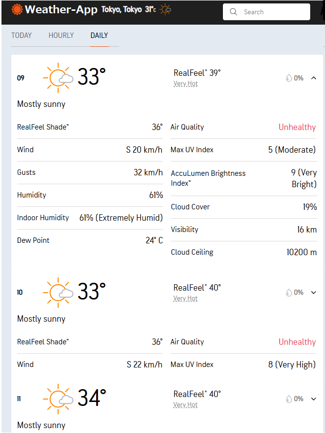

# Weather-App
A full-stack Weather Application built with Spring Boot and Vue.js that allows users to search for and view current weather information for any city worldwide.

## Technologies
- **Backend**: Spring Boot
- **Frontkend**: Vue.js
- **Database**: Optional (if you want to store user preferences or search history)
- **External API**: Use a weather API like OpenWeatherMap to fetch weather data.

## Page Mockups
- Index page:

---

- Today page:

---

- Hourly page:

---

- Daily page:

